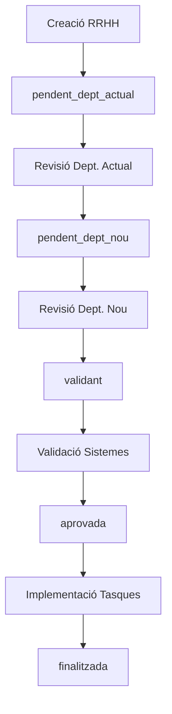

# 🔄 Procés de Mobilitat - Proposta d'Implementació

## 📋 Descripció General

El **Procés de Mobilitat** és un nou flux de treball per gestionar canvis de departament o funcions dels empleats dins l'organització. Aquest procés permet una transició controlada dels accessos als sistemes, involucrant tant el departament actual com el nou departament de l'empleat.

## 🎯 Objectius

- Gestionar canvis de departament d'empleats de forma controlada
- Revisar i ajustar accessos als sistemes segons les noves funcions
- Mantenir la seguretat i traçabilitat durant la transició
- Integrar-se amb el sistema existent de validacions i tasques

## 🔄 Flux del Procés

### 1. **Creació del Procés (RRHH)**
- **Responsable:** Rol RRHH
- **Accions:**
  - Crear nou procés de mobilitat
  - Especificar empleat afectat
  - Definir departament/funcions noves
  - Possibilitat d'actualitzar dades de l'empleat
- **Estat inicial:** `pendent_dept_actual`
- **Notificació:** Gestors del departament actual

### 2. **Revisió Departament Actual**
- **Responsable:** Gestors del departament actual de l'empleat
- **Pantalla:** Llista de tots els sistemes actuals de l'empleat
- **Accions disponibles:**
  - ✅ **Mantenir accés:** Sistema es manté per al nou departament
  - ❌ **Eliminar accés:** Marcar sistema per eliminació
- **Estat després:** `pendent_dept_nou`
- **Notificació:** Gestors del departament nou

### 3. **Revisió Departament Nou**
- **Responsable:** Gestors del departament nou de l'empleat
- **Pantalla:** 
  - Tots els sistemes actuals (inclosos els marcats per eliminar)
  - Selector per afegir nous sistemes
- **Accions disponibles:**
  - ✅ **Mantenir:** Conservar sistema amb mateix nivell
  - 🔄 **Modificar:** Canviar nivell d'accés
  - ❌ **Eliminar:** Confirmar eliminació
  - 🔄 **Re-afegir:** "Rescatar" sistemes marcats per eliminar
  - ➕ **Afegir nous:** Sistemes que no tenia abans
- **Estat després:** `validant`
- **Acció:** Genera `SolicitudAcces` automàticament

### 4. **Validació**
- **Responsable:** Validadors dels sistemes afectats
- **Procés:** Utilitza el sistema de validacions existent
- **Estat després:** `aprovada`

### 5. **Implementació**
- **Responsable:** Rols gestors dels sistemes
- **Procés:** Utilitza el sistema de tasques existent
- **Estat final:** `finalitzada`

## 🏗️ Arquitectura Tècnica

### Models Nous

#### `ProcessMobilitat`
```php
Schema::create('process_mobilitat', function (Blueprint $table) {
    $table->id();
    $table->string('identificador_unic')->unique(); // MOB-YYYYMMDD-XXXX
    $table->foreignId('empleat_id')->constrained('empleats');
    $table->foreignId('usuari_solicitant_id')->constrained('users');
    $table->foreignId('departament_actual_id')->constrained('departaments');
    $table->foreignId('departament_nou_id')->constrained('departaments');
    $table->enum('estat', [
        'pendent_dept_actual', 
        'pendent_dept_nou', 
        'validant', 
        'aprovada', 
        'finalitzada'
    ]);
    $table->text('justificacio');
    $table->json('dades_empleat_noves')->nullable(); // Canvis dades empleat
    $table->foreignId('solicitud_acces_id')->nullable()->constrained('solicituds_acces');
    $table->timestamp('data_finalitzacio')->nullable();
    $table->timestamps();
});
```

#### `ProcessMobilitatSistema`
```php
Schema::create('process_mobilitat_sistemes', function (Blueprint $table) {
    $table->id();
    $table->foreignId('process_mobilitat_id')->constrained('process_mobilitat');
    $table->foreignId('sistema_id')->constrained('sistemes');
    $table->foreignId('nivell_acces_original_id')->nullable()->constrained('nivells_acces');
    $table->foreignId('nivell_acces_final_id')->nullable()->constrained('nivells_acces');
    $table->enum('accio_dept_actual', ['mantenir', 'eliminar'])->default('mantenir');
    $table->enum('accio_dept_nou', ['mantenir', 'modificar', 'eliminar', 'afegir']);
    $table->enum('estat_final', ['mantenir', 'eliminar', 'afegir', 'modificar']);
    $table->boolean('processat_dept_actual')->default(false);
    $table->boolean('processat_dept_nou')->default(false);
    $table->timestamps();
});
```

### Resources Filament

#### `ProcessMobilitatResource` (RRHH)
- **Funcions:**
  - Crear nous processos de mobilitat
  - Visualitzar estat de tots els processos
  - Editar dades de l'empleat si cal
- **Permisos:** Rol RRHH

#### `ProcessMobilitatGestorResource` (Gestors)
- **Funcions:**
  - Veure processos del seu departament
  - Pantalles diferents segons estat:
    - **Dept. Actual:** Marcar sistemes per eliminar
    - **Dept. Nou:** Revisar i afegir sistemes
- **Permisos:** Rol Gestor
- **Filtres:** Per departament del gestor

### Jobs i Notificacions

```php
// Notificacions
NotificarGestorsDepartamentActual::class
NotificarGestorsDepartamentNou::class
NotificarMobilitatFinalitzada::class

// Processament
ProcessarRevisioActual::class
ProcessarRevisioNou::class
CrearSolicitudAccessMobilitat::class
```

## 🔗 Integració amb Sistema Actual

### Reutilització de Components
- ✅ **Sistema de Validacions:** Reutilitza `ValidacioSolicitud`
- ✅ **Sistema de Tasques:** Reutilitza `ChecklistTask`
- ✅ **Sistema de Notificacions:** Reutilitza Jobs existents
- ✅ **Rols i Permisos:** Utilitza estructura actual

### Nou Tipus de Sol·licitud
```php
// A SolicitudAcces
'tipus' => 'mobilitat' // Nou valor enum
'process_mobilitat_id' => // Relació amb procés origen
```

## 🎨 Interfícies d'Usuari

### Pantalla Departament Actual
```
┌─────────────────────────────────────────────────────────┐
│ Revisió d'Accessos - Departament Actual                │
│ Empleat: [Nom Empleat] → Nou Dept: [Nom Departament]   │
├─────────────────────────────────────────────────────────┤
│ Sistemes Actuals:                                       │
│                                                         │
│ ✅ Sistema A (Consulta)           [Mantenir] [Eliminar] │
│ ✅ Sistema B (Edició)             [Mantenir] [Eliminar] │
│ ✅ Sistema C (Administrador)      [Mantenir] [Eliminar] │
│                                                         │
│                            [Processar Revisió]         │
└─────────────────────────────────────────────────────────┘
```

### Pantalla Departament Nou
```
┌─────────────────────────────────────────────────────────┐
│ Definició d'Accessos - Departament Nou                 │
│ Empleat: [Nom Empleat] ← Dept Anterior: [Nom Dept]     │
├─────────────────────────────────────────────────────────┤
│ Sistemes Existents:                                     │
│                                                         │
│ ✅ Sistema A (Consulta)    [Mantenir] [Modificar] [❌]  │
│ ⚠️  Sistema B (Edició)     [Re-afegir] [Modificar] [❌] │ ← Marcat eliminar
│ ✅ Sistema C (Admin)       [Mantenir] [Modificar] [❌]  │
│                                                         │
│ Nous Sistemes:                                          │
│ [+ Afegir] [Sistema D ▼] [Nivell: Consulta ▼]         │
│ [+ Afegir] [Sistema E ▼] [Nivell: Edició ▼]           │
│                                                         │
│                            [Processar Canvis]          │
└─────────────────────────────────────────────────────────┘
```

## 🧮 Lògica de Resolució d'Accions

### Taula de Combinacions
| Dept. Actual | Dept. Nou    | Resultat Final | Descripció |
|--------------|--------------|----------------|------------|
| Mantenir     | Mantenir     | Mantenir       | Sense canvis |
| Mantenir     | Modificar    | Modificar      | Canvi de nivell |
| Mantenir     | Eliminar     | Eliminar       | Eliminació confirmada |
| Eliminar     | Re-afegir    | Mantenir       | "Rescatat" pel nou dept |
| Eliminar     | Modificar    | Modificar      | "Rescatat" amb canvi |
| -            | Afegir       | Afegir         | Sistema nou |

### Algoritme de Processament
```php
public function calcularEstatFinal($sistema): string
{
    $accioActual = $sistema->accio_dept_actual;
    $accioNou = $sistema->accio_dept_nou;
    
    return match([$accioActual, $accioNou]) {
        ['mantenir', 'mantenir'] => 'mantenir',
        ['mantenir', 'modificar'] => 'modificar', 
        ['mantenir', 'eliminar'] => 'eliminar',
        ['eliminar', 'mantenir'] => 'mantenir',
        ['eliminar', 'modificar'] => 'modificar',
        ['eliminar', 'eliminar'] => 'eliminar',
        [null, 'afegir'] => 'afegir',
        default => 'mantenir'
    };
}
```

## 📊 Estats i Transicions



## 🔐 Permisos i Seguretat

### Rols Involucrats
- **RRHH:** Crear i gestionar processos
- **Gestor:** Revisar processos del seu departament
- **Validador:** Validar canvis de sistemes
- **IT/Altres:** Implementar canvis via tasques

### Restriccions
- Gestors només veuen processos dels seus departaments
- No es poden modificar processos en estat incorrecte
- Validacions obligatòries per tots els canvis de sistemes

## 🚀 Avantatges de la Proposta

### ✅ Beneficis
- **Modular:** Procés independent però integrat
- **Reutilització:** Aprofita components existents
- **Flexible:** Permet diferents tipus de mobilitat
- **Traçable:** Historial complet de canvis
- **Segur:** Validacions i aprovacions múltiples
- **Escalable:** Fàcil afegir més funcionalitats

### 🎯 Casos d'Ús Coberts
- Canvi de departament complet
- Canvi de funcions dins mateix departament
- Promocions amb nous accessos
- Reorganitzacions departamentals
- Canvis temporals o permanents

## 📅 Fases d'Implementació

### Fase 1: Models i Migracions
- Crear models `ProcessMobilitat` i `ProcessMobilitatSistema`
- Migracions de base de dades
- Relacions amb models existents

### Fase 2: Resources Filament
- `ProcessMobilitatResource` per RRHH
- `ProcessMobilitatGestorResource` per gestors
- Pantalles personalitzades per cada estat

### Fase 3: Jobs i Notificacions
- Jobs de notificació per cada pas
- Integració amb sistema de notificacions existent
- Emails personalitzats

### Fase 4: Integració i Testing
- Connexió amb `SolicitudAcces`
- Testing del flux complet
- Documentació d'usuari

## 🔧 Configuració Necessària

### Variables d'Entorn
```env
# Configuració mobilitat
MOBILITAT_IDENTIFICADOR_PREFIX=MOB
MOBILITAT_NOTIFICACIONS_ENABLED=true
MOBILITAT_AUTO_VALIDACIO=false
```

### Permisos Spatie
```php
// Nous permisos necessaris
'crear_proces_mobilitat'
'gestionar_proces_mobilitat'  
'revisar_proces_mobilitat_dept'
'validar_proces_mobilitat'
```

---

**Document generat el:** 23 de Juliol de 2025  
**Versió:** 1.0  
**Autor:** Sistema de Gestió d'Accessos (SIAE)
